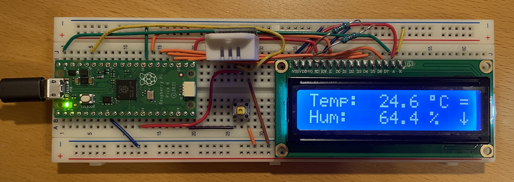

# thermometer
Welcome to my Raspberry Pico hello world project, a breadboard thermometer featuring a [DHT22 sensor](https://www.adafruit.com/product/385) and a [16x2 LCD](https://www.adafruit.com/product/181).
I challenged myself to write the drivers from scratch based on some crappy chinasheets - so handle with care ;).



## Features
- Display current temperature and humidity (updates every 30s)
- Minimum and maximum values, press switch to toggle screen, hold switch to reset values
- Maybe some bugs because embedded is *fun*

## Build Instructions
0. Prerequisites
    - Setup a Raspberry Pico dev environment: [Getting started guide](https://datasheets.raspberrypi.com/pico/getting-started-with-pico.pdf). Make sure the SDK example projects compile.
    - Arrange the hardware components on a breadboard: You'll need a Raspberry Pico, a DHT22 sensor, a LCD1602-type display with parallel data lines (my app uses the 4-bit interface), a switch (optional, for min-max values), some resistors to adjust the LCD contrast at V0 and a bunch of wires.
    - I used the following [pinout](https://pico.pinout.xyz/), but feel free to adjust the pins in [main.c](src/main.c):
        | Physical | GPIO | Connected to |
        | -------- | ---- | ------------ |
        | 12       | GP9  | DHT Data     |
        | 19       | GP14 | Switch (to GND) |
        | 21       | GP16 | LCD RS       |
        | 22       | GP17 | LCD D7       |
        | 24       | GP18 | LCD D6       |
        | 25       | GP19 | LCD D5       |
        | 26       | GP20 | LCD D4       |
        | 27       | GP21 | LCD EN       |

1. Clone the repo
    ```sh
    # clone via ssh
    git clone git@github.com:deermichel/thermometer.git

    # or via https
    git clone https://github.com/deermichel/thermometer.git
    ```

2. Build the app
    ```sh
    # ensure PICO_SDK_PATH points to the SDK path
    echo $PICO_SDK_PATH

    # configure
    cd thermometer
    mkdir build && cd build
    cmake ..

    # build
    make -j
    ```

3. Flash, run, pray
    - Use the `thermometer.uf2` or `thermometer.elf` output file for flashing. Refer to the "Getting started" guide if you need help with this step.
    - If you wired everything correctly, you got yourself another thermometer - congrats! Now go ahead and change your LinkedIn bio to Embedded Software Engineer :)

## License
This library is released under the MIT License.
```
MIT License

Copyright (c) 2022 Micha Hanselmann

Permission is hereby granted, free of charge, to any person obtaining a copy
of this software and associated documentation files (the "Software"), to deal
in the Software without restriction, including without limitation the rights
to use, copy, modify, merge, publish, distribute, sublicense, and/or sell
copies of the Software, and to permit persons to whom the Software is
furnished to do so, subject to the following conditions:

The above copyright notice and this permission notice shall be included in all
copies or substantial portions of the Software.

THE SOFTWARE IS PROVIDED "AS IS", WITHOUT WARRANTY OF ANY KIND, EXPRESS OR
IMPLIED, INCLUDING BUT NOT LIMITED TO THE WARRANTIES OF MERCHANTABILITY,
FITNESS FOR A PARTICULAR PURPOSE AND NONINFRINGEMENT. IN NO EVENT SHALL THE
AUTHORS OR COPYRIGHT HOLDERS BE LIABLE FOR ANY CLAIM, DAMAGES OR OTHER
LIABILITY, WHETHER IN AN ACTION OF CONTRACT, TORT OR OTHERWISE, ARISING FROM,
OUT OF OR IN CONNECTION WITH THE SOFTWARE OR THE USE OR OTHER DEALINGS IN THE
SOFTWARE.
```
